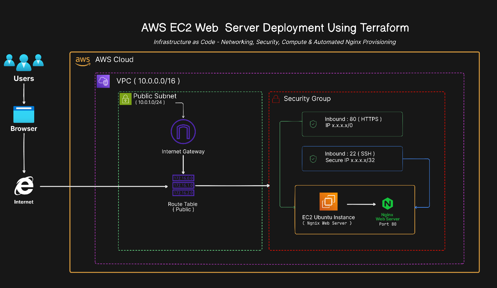

# AWS EC2 Web Server Deployment using Terraform

This project deploys a basic Linux web server on AWS using Terraform.

The purpose of this project is to practise Infrastructure as Code by provisioning AWS networking, security, compute, and automated Nginx setup without manually creating resources through the AWS Console.

---

## Project Overview

This project demonstrates how to provision AWS infrastructure using Terraform and automatically deploy a simple Nginx-hosted static web page on an Ubuntu EC2 instance.

The project focuses on:

- Infrastructure as Code
- AWS VPC fundamentals
- Public subnet configuration
- Internet Gateway and route table setup
- EC2 instance provisioning
- Security Group inbound rules
- Automated server configuration using EC2 user data
- Testing and documenting a small cloud deployment

---

## Architecture



[View editable architecture diagram in Eraser](https://app.eraser.io/workspace/10SDNiSyS0AF5Qn40GuA?origin=share)

---

## What This Project Deploys

This Terraform project provisions:

- AWS VPC
- Public Subnet
- Internet Gateway
- Public Route Table
- Route Table Association
- Security Group
- SSH Key Pair
- Ubuntu EC2 Instance
- Nginx Web Server installed using EC2 user data

---

## Technology Stack

- AWS
- Terraform
- EC2
- VPC
- Security Groups
- Ubuntu Linux
- Nginx
- Bash
- GitHub

---

## Architecture Flow

User traffic flows through the following path:

```text
User Browser
    ↓
Internet
    ↓
AWS Internet Gateway
    ↓
Public Route Table
    ↓
Public Subnet
    ↓
Security Group
    ↓
EC2 Ubuntu Instance
    ↓
Nginx Web Server
```